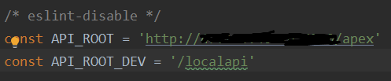
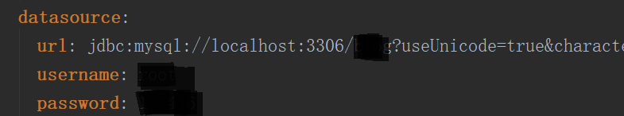
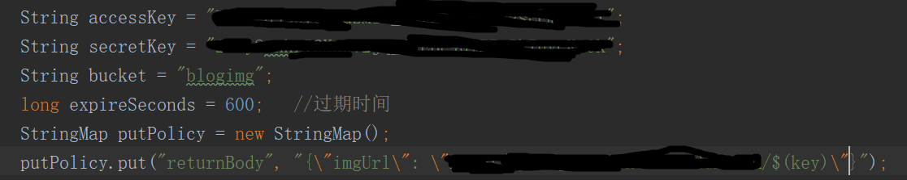
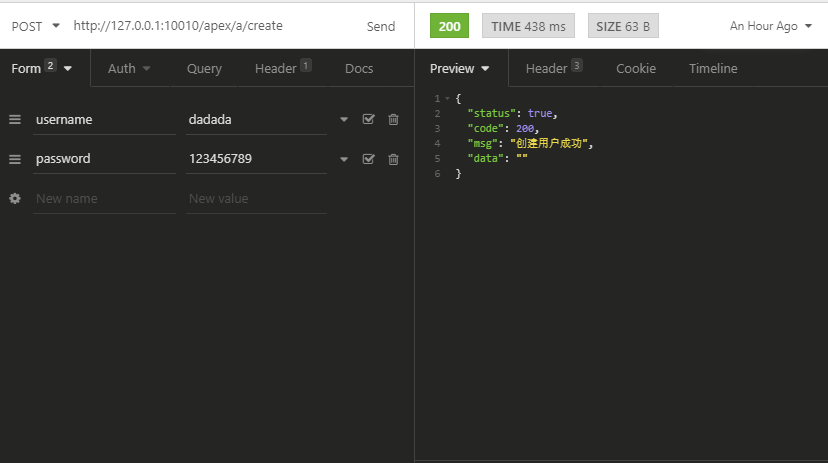
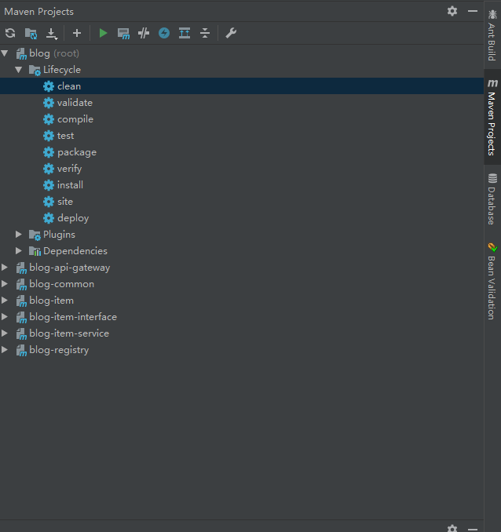

## 博客项目

这是一个基于Vue+Springboot+Springcloud的博客项目，实现了前后端分离。前端使用了[CB-ysx](https://github.com/CB-ysx/myblog/commits?author=CB-ysx)的客户界面和后台管理系统。后端使用了当前的Springboot项目。因为前端的接口并没有实现标准的REST风格，因此本项目中也只使用了GET和POST方法来实现所有功能。

### 博客地址

[博客地址](http://47.100.40.16/home)

### 技术选型

#### 前端

- [X] vue
- [X] ElementUi

#### 后端

- [X] Springboot
- [X] Mybatis
- [X] SpringCloud


### 博客实现功能

#### 客户界面

- [X] 文章列表
- [X] 分类/标签列表（按列表搜索文章）
- [X] 文章按时间归档
- [X] “关于我”界面
- [X] 搜索功能
- [X] 评论
- [X] 文章详情页
- [ ] 友链

#### 后台管理页面

- [X] 登陆
- [X] 首页数据统计
- [X] 文章增删改查
- [X] 标签增删改查
- [X] 分类增删改查
- [X] 编辑“关于我”
- [X] 编辑博客配置页面
- [X] 评论管理

## 部署方法

### 本地测试部署

1.前往[前端代码](https://github.com/CB-ysx/myblog)Clone代码

2.用WebStorm打开前端项目，修改`src/api/index.js`



在涂黑处修改成自己的地址或者域名，如在本地测试可直接用ip，例如填写为`127.0.0.1:4677`

3.在下面Terminal处输入`npm install -g vue-cli`，就会自动安装相关依赖（需要先安装node.js）

4.在Terminal输入`npm run build`，则会编译程序，生成可以运行的静态资源。结束后可以在项目根目录下看到dist文件夹

5.Clone当前项目，使用IDEA打开当前项目，根据软件提示导入Maven所提示的相关依赖

6.数据库配置文件在`blog-item/blog-item-service/src/main/resource/application.yaml`，修改数据库的数据库名，账号和密码。其中数据库表的结构文件在当前项目的根目录下，可以事先导入到Mysql中。



7.项目中图片都放在了七牛云上，使用前需要先注册一个七牛云账号。注意需要把对象存储空间的名字改成`blogimg`。在自己的七牛云上取得AK.SK以及空间域名，填入到以下位置中，该文件在`blog-item/blog-item-service/src/main/java/com/blog/item/controller/TokenController`中。



8.在`blog-item/blog-item-service/src/main/java/com/blog/item/controller/AdminController`取消注释注册的那部分代码，因为数据库中没有用户信息是无法登陆后台管理页面的。

9.配置Nginx，以上面第二步中配置的4677端口为例子，下面是部分配置文件，这里直接使用Nginx实现了跨域访问，简单粗暴，配置完并启动


```conf
	server {
        listen       80;
        server_name  127.0.0.1;
		root	填第四步生成dist文件夹的目录;

        #charset koi8-r;

        #access_log  logs/host.access.log  main;

        location / {
            try_files	$uri $uri/ /index.html;
            index  index.html index.htm index.php;
        }
	}

	server {
		listen 4677;
		server_name 127.0.0.1;

		add_header Access-Control-Allow-Origin *;
		add_header Access-Control-Allow-Methods GET,POST,OPTIONS,PUT,DELETE;
		add_header Access-Control-Allow-Headers Content-Type,isdebug,isAdmin,accessToken,x-requested-with;
		add_header Access-Control-Allow-Credentials true;
		
		location / {
			index index.html index.htm index.php;
		}
		
		location /apex {
		
		if ($request_method = 'OPTIONS') {
			 return 200;
			}
		
			proxy_pass http://127.0.0.1:10010;
			proxy_set_header Host $host:4677;
			proxy_set_header X-Real-IP $remote_addr;
			proxy_set_header X-Forwarded-For $proxy_add_x_forwarded_for;
			proxy_connect_timeout 600;
			proxy_read_timeout 600;
		}
	}
```

10.在IDEA中调出Dashboard,在里面分别运行三个微服务`BlogRegistry`、`BlogApiGateway`和`BlogItemService`。

11.浏览器访问`127.0.0.1`就可以直接访问博客页面了，使用POSTMAN或者Insomnia等发包工具创建账户，如下图所示：



12.通过`127.0.0.1/admin`，并使用刚才创建的账号密码登陆到后台页面。

### 服务器部署方法

可以在阿里云或者腾讯云中部署自己的博客，部署方法和本地部署方法类似。前端项目可以直接将dist文件夹放在服务器中，本后端项目则可以通过打包成jar包的方式进行部署。

在IDEA中，可以在右侧栏调出Maven Project。在父工程中点击install按键，接下来会自动对每一个子工程进行打包，并生成jar包



在每一个子工程的target下都有生成的jar包，将它们放到服务器中，运行其中三个`blog-registry-1.0.0-SNAPSHOT.jar`、`blog-api-gateway-1.0.0-SNAPSHOT.jar`、`blog-item-service-1.0.0-SNAPSHOT.jar`

运行命令如下：

`nohup java -jar xxx.jar > systemxxx.log 2>&1 &`

其中前一个xxx代表每一个包名，后一个用来区分每一个进程所记录的日志名字
